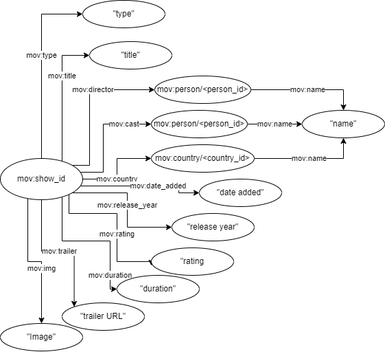
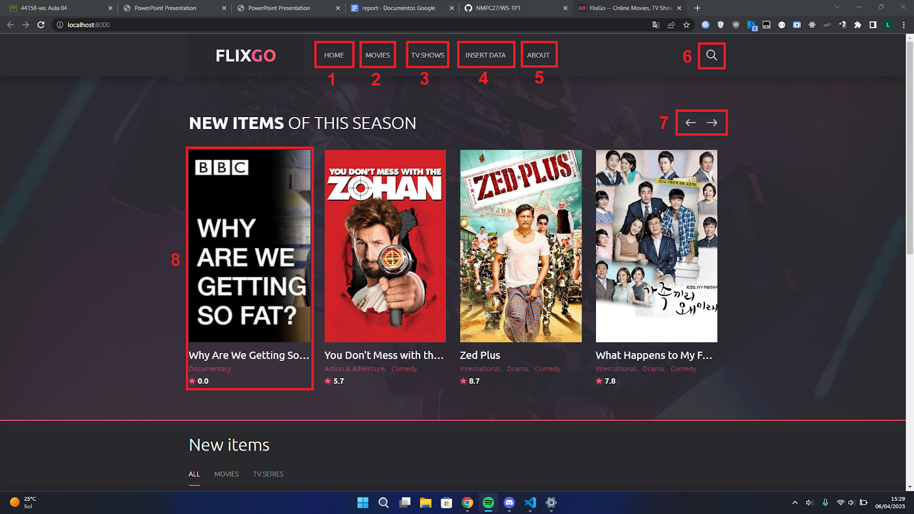
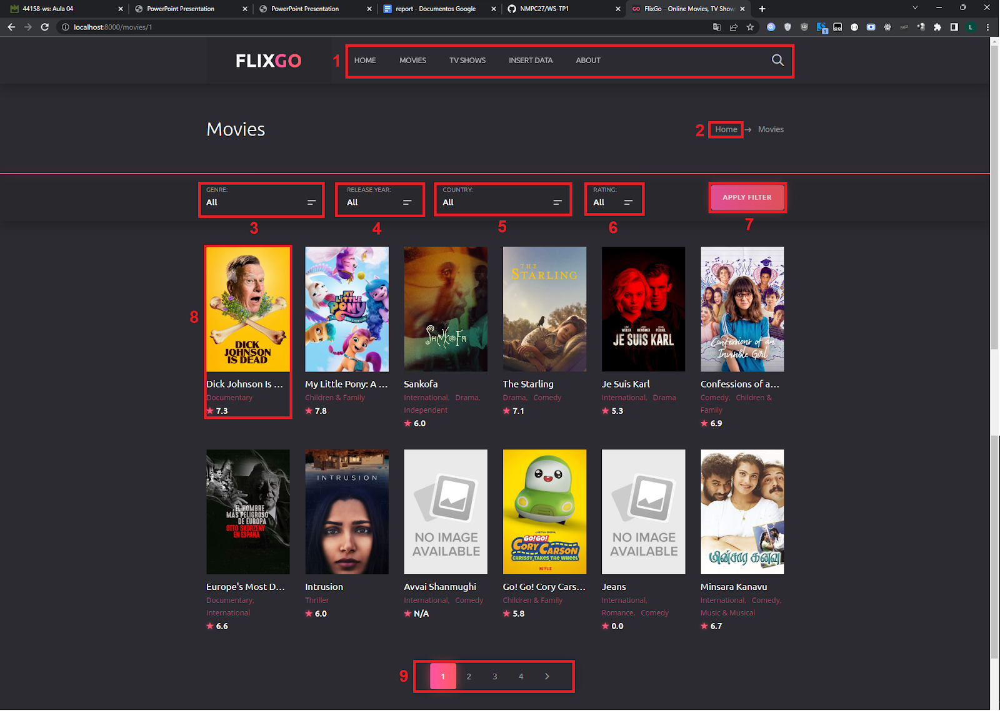
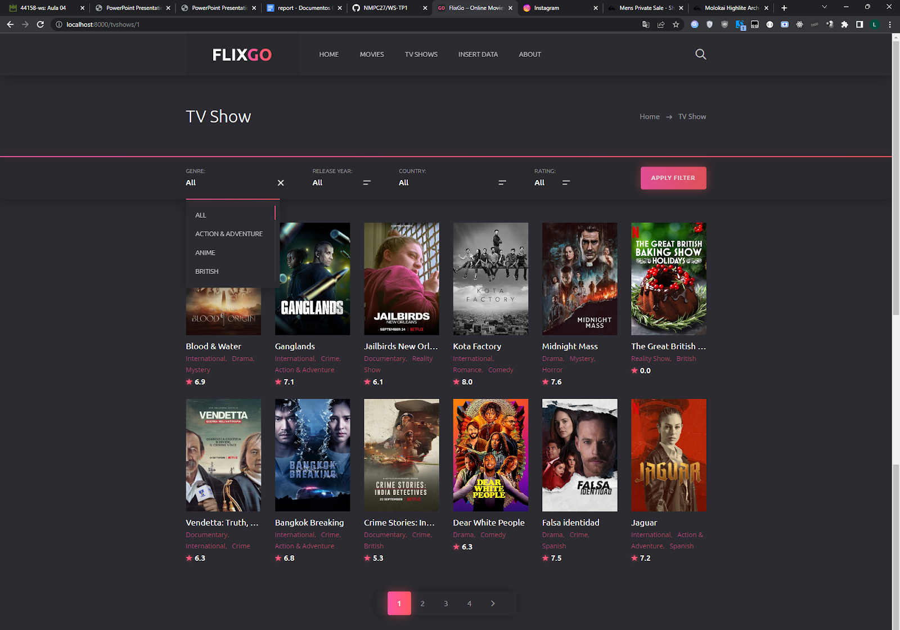
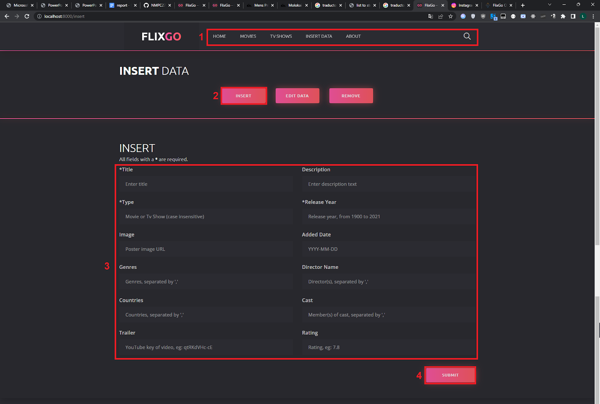
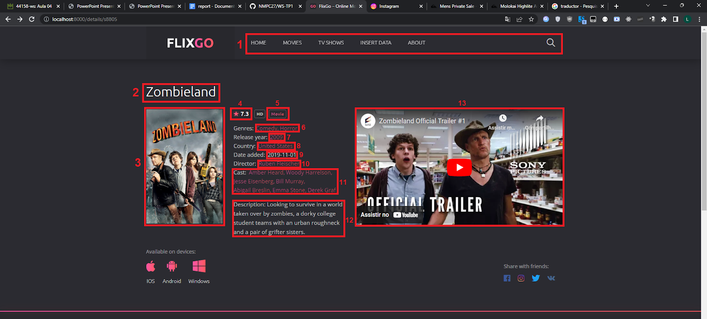
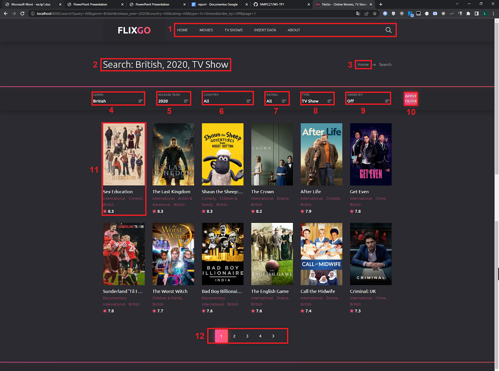

#  FlixUA — Online Movies and TV Shows Web App

FlixUA is a Django-based web application that simulates an online movie and TV show streaming platform, similar to Netflix.  
It allows users to **browse, search, and manage** a catalog of movies and TV shows stored in a **GraphDB repository** using **SPARQL queries**.

----------

##  Table of Contents

-   [Overview](#overview)
    
-   [Features](#features)
    
-   [Dataset and Data Processing](#dataset-and-data-processing)
    
-   [SPARQL Operations](#sparql-operations)
    
-   [Installation](#installation)
    
-   [Database Setup](#database-setup)
    
-   [Running the Server](#running-the-server)
    
-   [Application Pages](#application-pages)
    
-   [Credits](#credits)
    

----------

##  Overview

FlixUA was developed as part of the _Web Semantics Practical Work 1 (WS-TP1)_ at the **University of Aveiro**.  
The goal of the project was to build a semantic web application capable of managing and querying movie and TV show data stored in RDF format.

----------

##  Features

-   **Home Page:** Overview of featured movies and TV shows.
    
-   **Movies / TV Shows:** Filter and search by genre, year, country, or rating.
    
-   **Search:** Full-text and filtered search across all content.
    
-   **Insert Data:** Add, edit, or delete movies and shows directly from the interface.
    
-   **Details Page:** View complete information, including trailer, rating, genre, cast, and director.
   
   

----------

##  Dataset and Data Processing

The dataset used is from **[Netflix Shows on Kaggle](https://www.kaggle.com/datasets/shivamb/netflix-shows)**.  
It contains information such as:

-   Title, type, director, cast, country
    
-   Date added, release year, rating, duration, genres, and description
    

Additional data (images, trailers, and ratings) were retrieved using **The Movie Database API (TMDB)**.

The data was converted into **N-Triples format** and imported into **GraphDB** using custom scripts located in `DB/process.py`.  
The final RDF dataset is stored in `DB/netflix_triples.nt`.

**This is the final overview of the graph created. “mov” is the prefix http://netflixUA.org**

----------

##  SPARQL Operations

SPARQL queries for data retrieval and manipulation are located in `webApp/app/DBquery.py`.  
Key queries include:

-   `select_all_*`: Retrieve movies and TV shows
    
-   `get_showById`: Get detailed information for a specific show
    
-   `searchQuery`: Perform filtered searches
    
-   `InsertData`, `deleteByTitle`: Modify the RDF data
    

----------

##  Installation

Clone the repository and install dependencies:

`git clone https://github.com/<your-username>/WS-TP1.git cd WS-TP1
pip install -r requirements.txt` 

Alternatively, install dependencies manually:

`pip install Django
pip install s4api` 

----------

##  Database Setup

1.  Open **GraphDB** at [http://localhost:7200](http://localhost:7200).
    
2.  Create a new repository named **`movies`**.
    
3.  Import the file `DB/netflix_triples.nt`.
    
4.  Set the **Base IRI** to:
    
    `http://netflixUA.org/` 
    
5.  If you’re using a different port or repository name, update these details in `config.json` (at the project root).
    

----------

##  Running the Server

Navigate to the Django app folder and start the server:

`cd webApp`

`python3 manage.py runserver` 

If static files (e.g., CSS) are not being served, run:

`python3 manage.py runserver --insecure` 

The application will be available at:  
 **[http://localhost:8000](http://localhost:8000)**

----------

##  Application Pages

Page

Description

**Home**

Main dashboard with featured shows and navigation.

**Movies**

Browse and filter movies by genre, year, country, or rating.

**TV Shows**

Similar to Movies page, but focused on TV content.

**Insert Data**

Add, edit, or delete shows directly from the app.

**Details**

Display all details for a selected show, including trailer and cast.

**Search**

Advanced search with multiple filters.

----------

##  Credits

-   Nuno Cunha — 98124
    
-   Alexandre Gago — 98123
    
-   Bernardo Kaluza — 97521
    

----------

## Conclusion

This project demonstrates the integration of **semantic web technologies**, **SPARQL querying**, and **web development using Django**.  
FlixUA showcases how linked data and knowledge representation can enhance interactive media platforms.